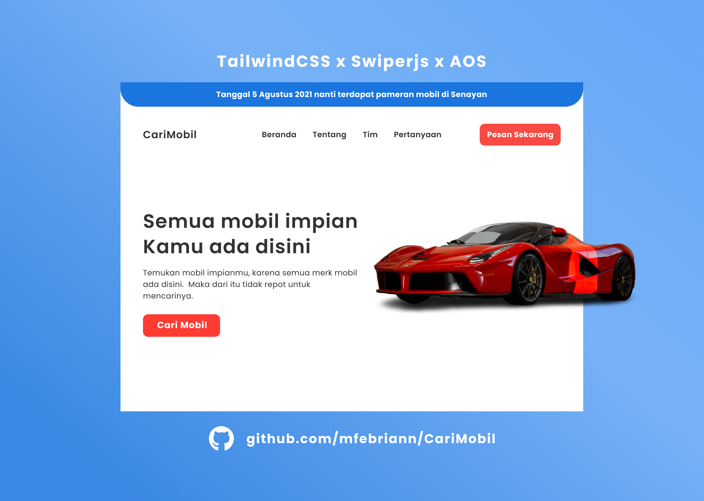

### Website landing page to learn about TailwindCSS

Just website landing page and just learn about [TailwindCSS](https://tailwindcss.com/docs) such as the command, the configuration, the installation process and etc. CariMobil is website for you can find car you like. Here too i use [Swiperjs](https://swiperjs.com/) for run touch slider like a cards for example and use [AOS](https://michalsnik.github.io/aos/) for animation.

You can see the website [Demo](https://mfebriann.github.io/CariMobil/)  
You can see also design in figma [Design](https://www.figma.com/file/2Jw1nxz1j2H9UVFnr7mElu/CariMobil?node-id=0%3A1) although not 100% exactly the same 😅
